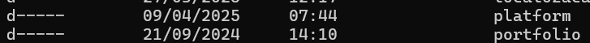

<h2>Time</h2>

[ Claudeny Avelino](https://github.com/ClaudenyAvelino)

## 🚀 Tecnologias

  
  
 <!--   -->

Aula de HTML: Estrutura e Ferramentas 🔧🌐
🔖 Sobre

Anotações da aula sobre HTML, com foco em estruturação, ferramentas e boas práticas para iniciantes.

📝 O que foi abordado nesta aula?
1. A Importância da Documentação W3S 📚

A W3Schools (W3S) é uma excelente fonte de aprendizado para quem está iniciando com HTML e outras tecnologias web. A documentação oferece explicações detalhadas sobre as tags, atributos e boas práticas do HTML.

Consultar a documentação é fundamental para entender as funcionalidades da linguagem e aprender como usá-las corretamente.

🔗 Link para a W3Schools: https://www.w3schools.com/

2. O que é HTML e Por que é Considerada uma Linguagem de Marcação? 🤔

HTML (HyperText Markup Language) é uma linguagem de marcação usada para estruturar conteúdo na web. Diferente das linguagens de programação, HTML não executa ações ou processos lógicos, mas define a estrutura de uma página da web, como textos, imagens, links, e muito mais.

Marcação: A linguagem usa tags para marcar diferentes partes do conteúdo (exemplo: títulos, parágrafos, listas).

Objetivo: Organizar o conteúdo de forma que o navegador entenda como exibir na tela do usuário.

3. Estruturar um Documento HTML com Tags e Elementos 🏗️

O HTML usa tags para estruturar e identificar diferentes partes do conteúdo. Cada tag possui uma função específica. As tags de abertura e fechamento delimitam o conteúdo, como:
~~~
<html></html>   <!-- Elemento raiz de uma página HTML -->
<head></head>   <!-- Metadados, como título e links para estilos -->
<body></body>   <!-- Conteúdo visível na página -->
~~~
4. A Utilidade da Introdução <!DOCTYPE html> ⚙️

A declaração <!DOCTYPE html> informa ao navegador que o documento é um arquivo HTML5. Isso é fundamental para garantir que a página seja interpretada corretamente de acordo com a versão mais recente do HTML.

Mesmo que o arquivo tenha a extensão .html, essa declaração é essencial para definir o contexto do documento.

5. Diferença entre a Metainformação no <head> e o Conteúdo no <body> 💡

<head>: Contém metadados e informações sobre o documento (como o título da página e links para estilos ou scripts). Esses dados não são visíveis diretamente na página, mas são essenciais para seu funcionamento.

<body>: Contém o conteúdo visível da página, como textos, imagens, links e elementos interativos que o usuário verá no navegador.

6. Criar Textos Alternativos (alt) para uma Imagem 🖼️

No HTML, é importante usar o atributo alt para fornecer uma descrição textual de uma imagem. Isso não só ajuda na acessibilidade (para leitores de tela, por exemplo), mas também melhora o SEO da página.

~~~

~~~

7. Acessar a Developer Tools (Ferramentas para Desenvolvedores) de um Navegador 🔍

As Ferramentas para Desenvolvedores são essenciais para:

Inspecionar o HTML, CSS e JavaScript

Editar estilos em tempo real

Monitorar erros no console

Como abrir:

F12 ou Ctrl + Shift + I (Chrome, Firefox e outros navegadores)

8. Quirks Mode (Modo Peculiaridade) 🤖

O Quirks Mode ocorre quando o navegador interpreta um documento HTML de maneira não-padrão, afetando o layout e o comportamento da página.

Esse modo geralmente acontece em páginas que não começam com a declaração <!DOCTYPE html>. Para evitar problemas de compatibilidade, sempre inicie o documento com:
~~~
<!DOCTYPE html>
~~~
9. Utilizar Extensões no Visual Studio Code (Exemplo: Live Server) 🔌

O Visual Studio Code (VS Code) é uma poderosa IDE. Com a extensão Live Server, você pode visualizar alterações em tempo real no navegador.

💡 Como instalar o Live Server:

Abra o Visual Studio Code.

Vá para a barra lateral de extensões (ícone de quadrado com 4 blocos).

Pesquise por Live Server.

Clique em Instalar.

Clique com o botão direito no arquivo HTML e selecione "Open with Live Server".

✅ Benefícios:

Atualização automática da página no navegador

Visualização em tempo real de mudanças no HTML e CSS

Acelera o desenvolvimento e testes

🧪 Exemplo de Estrutura Completa de um Documento HTML5

💻 Exemplo de Estrutura HTML com Comentários
~~~
<!-- Informa ao navegador que o documento está usando HTML5 -->
<!DOCTYPE html>

<!-- Elemento raiz do documento HTML -->
<html lang="pt-br">

<!-- Cabeçalho do documento: contém metadados e configurações -->
<head>
    <meta charset="UTF-8"> <!-- Define a codificação de caracteres para UTF-8 -->
    <meta http-equiv="X-UA-Compatible" content="IE=edge"> <!-- Compatibilidade com Internet Explorer -->
    <meta name="viewport" content="width=device-width, initial-scale=1.0"> <!-- Responsividade -->
    
    <title>Portfólio</title> <!-- Título da aba do navegador -->
</head>

<!-- Corpo do documento: tudo que é exibido ao usuário -->
<body>
    <h1>Isso é um título</h1> <!-- Título principal da página -->

    
Isso é um parágrafo
 <!-- Texto descritivo ou informativo -->

     <!-- Imagem com descrição alternativa -->
</body>

</html>

~~~

📌 Esse exemplo mostra:

A estrutura básica de um documento HTML5.

Comentários explicativos dentro do código (que não aparecem no navegador).

O uso correto do alt em imagens.

Uma base limpa e clara para qualquer página HTML simples.

🧱 Estrutura Semântica do HTML5
~~~
<body>
    <header></header> <!-- Cabeçalho da página: logo, navegação, etc. -->
    <main></main>     <!-- Conteúdo principal da página -->
    <footer></footer> <!-- Rodapé: contatos, créditos, direitos autorais -->
</body>
~~~

📌 Explicação rápida:

<header>: onde normalmente ficam o logotipo, menus ou títulos.

<main>: contém o conteúdo central da página — deve aparecer só uma vez no documento.

<footer>: onde vão os créditos, links de contato ou informações legais.

