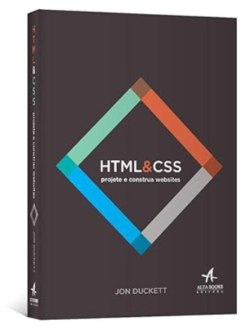

# 📘 Aula de HTML: Estrutura e Ferramentas 🔧🌐

Anotações da aula sobre HTML, com foco em estruturação, ferramentas e boas práticas para iniciantes.

---

## 👨‍🏫 Autor

[<br><sub>Claudeny Avelino</sub>](https://github.com/ClaudenyAvelino)

---

## 🚀 Tecnologias


---

## 📑 Conteúdo da Aula

### 1. A Importância da Documentação W3Schools 📚

A W3Schools é uma excelente fonte para aprender HTML e outras tecnologias web.
🔗 [Acesse W3Schools](https://www.w3schools.com/)

---

### 2. O que é HTML? 🤔

**HTML (HyperText Markup Language)** é uma linguagem de marcação usada para estruturar conteúdo na web. Ela **não executa ações**, apenas organiza elementos como:

* Textos
* Imagens
* Links
* Listas

---

### 3. Estrutura Básica de um Documento HTML 🏗️

```html
<!DOCTYPE html>
<html lang="pt-br">
<head>
  <meta charset="UTF-8">
  <meta http-equiv="X-UA-Compatible" content="IE=edge">
  <meta name="viewport" content="width=device-width, initial-scale=1.0">
  <title>Título da Página</title>
</head>
<body>
  <h1>Isso é um título</h1>
  <p>Isso é um parágrafo</p>
  
</body>
</html>
```

---

### 4. A Utilidade da Tag `<!DOCTYPE html>` ⚙️

* Define o documento como HTML5.
* Evita o **Quirks Mode** (modo de compatibilidade antiga nos navegadores).

---

### 5. Diferença entre `<head>` e `<body>` 💡

* `<head>`: Contém **metadados** (título da aba, links de estilo, scripts).
* `<body>`: Contém o **conteúdo visível** da página.

---

### 6. Atributo `alt` nas Imagens 🖼️

Melhora a **acessibilidade** e o **SEO** do site.

```html

```

---

### 7. Developer Tools 🔍

Ferramentas do navegador para:

* Inspecionar HTML/CSS
* Depurar erros
* Testar alterações em tempo real

Acessos rápidos:

* `F12`
* `Ctrl + Shift + I`

---

### 8. Quirks Mode 🤖

Modo de renderização "antigo".
**Evite sempre iniciando seus documentos com:**

```html
<!DOCTYPE html>
```

---

### 9. Extensão Live Server no VS Code 🔌

Permite:

* Atualização automática da página no navegador
* Visualização em tempo real de alterações

**Como instalar:**

1. Abrir VS Code
2. Ir em Extensões (`Ctrl+Shift+X`)
3. Procurar por *Live Server*
4. Clicar em **Instalar**

---

### 🧱 Estrutura Semântica do HTML5

```html
<body>
  <header></header> <!-- Cabeçalho -->
  <main></main>     <!-- Conteúdo principal -->
  <footer></footer> <!-- Rodapé -->
</body>
```

---

### ✨ Exemplo de Projeto

```html
<!DOCTYPE html>
<html lang="pt-br">
<head>
  <meta charset="UTF-8">
  <meta http-equiv="X-UA-Compatible" content="IE=edge">
  <meta name="viewport" content="width=device-width, initial-scale=1.0">
  <title>Portfolio</title>
</head>
<body>
  <header></header>
  <main>
    <h1>Eleve seu negócio digital a outro nível <strong>com um Front-end de qualidade!</strong></h1>
    <p>Olá! Sou Joana Santos, desenvolvedora Front-end com especialidade em React, HTML e CSS. Ajudo pequenos negócios e designers a colocarem em prática boas ideias. Vamos conversar?</p>
    <a href="https://instagram.com/">Instagram</a>
    <a href="https://github.com/">GitHub</a>
  </main>
  <footer></footer>
</body>
</html>
```


# 🎓 Aula de CSS – Página de Apresentação

Este repositório contém uma introdução prática ao **CSS**, com foco em estilização de páginas, boas práticas e aplicação em layouts modernos.

---

## 👨‍🏫 Autor

[<br><sub>Claudeny Avelino</sub>](https://github.com/ClaudenyAvelino)

---

## 🚀 Tecnologias


---

## 📑 Conteúdo da Aula

### 1️⃣ Importando Fontes Personalizadas

```css
@import url('https://fonts.googleapis.com/css2?family=Krona+One&family=Montserrat:wght@400;600&display=swap');
```

* **Krona One** → usada no título
* **Montserrat** → usada nos textos e botões

---

### 2️⃣ Resetando o Estilo Padrão

```css
* {
    margin: 0;
    padding: 0;
}
```

Remove margens e paddings padrão do navegador para garantir consistência no layout.

---

### 3️⃣ Estilizando o `body`

```css
body {
    height: 100vh;
    box-sizing: border-box;
    background-color: #000000;
    color: #F6F6F6;
}
```

---

### 4️⃣ Criando Destaques com Cores

```css
.titulo-destaque {
    color: #22D4FD;
}
```

---

### 5️⃣ Estrutura Principal: `.apresentacao`

```css
.apresentacao {
    margin: 10%;
    display: flex;
    align-items: center;
    justify-content: space-between;
}
```

---

### 6️⃣ Área de Texto: `.apresentacao__conteudo`

```css
.apresentacao__conteudo {
    width: 615px;
}
```

---

### 7️⃣ Título do Texto

```css
.apresentacao__conteudo__titulo {
    font-size: 36px;
    font-family: 'Krona One', sans-serif;
}
```

---

### 8️⃣ Parágrafo Descritivo

```css
.apresentacao__conteudo__texto {
    font-size: 24px;
    font-family: 'Montserrat', sans-serif;
}
```

---

### 9️⃣ Botões de Link

```css
.apresentacao__links {
    display: flex;
    justify-content: space-between;
}

.apresentacao__links__link {
    background-color: #22D4FD;
    width: 280px;
    text-align: center;
    border-radius: 16px;
    font-size: 24px;
    font-weight: 600;
    padding: 21.5px 0;
    text-decoration: none;
    color: #000000;
    font-family: 'Montserrat', sans-serif;
}
```

---

## 🖼 Resultado Visual Esperado

* Página escura, texto claro
* Lado esquerdo: título, parágrafo e botões
* Lado direito: imagem ou ilustração

---

## 🎒 Exercício Prático

1. Crie um arquivo `style.css` com o código acima.
2. Crie um HTML com a seguinte estrutura:

```html
<!DOCTYPE html>
<html lang="pt-br">
<head>
  <meta charset="UTF-8">
  <title>Apresentação</title>
  <link rel="stylesheet" href="style.css">
</head>
<body>
  <section class="apresentacao">
    <div class="apresentacao__conteudo">
      <h1 class="apresentacao__conteudo__titulo">
        Eleve seu negócio com <strong class="titulo-destaque">tecnologia</strong>
      </h1>
      <p class="apresentacao__conteudo__texto">
        Desenvolvedor apaixonado por soluções criativas.
      </p>
      <div class="apresentacao__links">
        <a class="apresentacao__links__link" href="#">GitHub</a>
        <a class="apresentacao__links__link" href="#">LinkedIn</a>
      </div>
    </div>
    
  </section>
</body>
</html>
```

---

## 📌 Dicas

* Use **Live Server** no VS Code para visualizar alterações em tempo real.
* Experimente alterar cores, fontes e tamanhos para entender o impacto no layout.
* Teste o CSS em diferentes navegadores e resoluções para melhorar responsividade.


# 🎨 Aula: Google Fonts — Como Usar Fontes Personalizadas no seu Site

## ✅ Objetivo da Aula
Ensinar como utilizar a biblioteca **Google Fonts** para aplicar diferentes fontes em projetos web com **HTML** e **CSS**.

---

## 📌 O que é o Google Fonts?
O **Google Fonts** é uma biblioteca gratuita do Google com mais de **1000 fontes tipográficas** de código aberto.  
Ele permite que você utilize essas fontes facilmente em sites, sistemas ou qualquer projeto web.

- ✅ Licença livre para uso pessoal e comercial  
- ✅ Compatível com todos os navegadores modernos  
- ✅ Fácil de integrar via HTML ou CSS  

🔗 [Acesse o site oficial do Google Fonts](https://fonts.google.com)

---

## 🧭 Como Navegar no Google Fonts
1. Acesse [https://fonts.google.com](https://fonts.google.com)  
2. Use os filtros para buscar por:  
   - Categoria (Serif, Sans Serif, Display etc.)  
   - Estilo (Regular, Italic, Bold...)  
   - Idioma (incluindo suporte ao português)  
3. Clique em uma fonte para visualizar os estilos e como incorporá-la no seu projeto.  

---

## 📥 Como Importar Fontes

### 🔗 Via `<link>` no HTML
```html
<head>
  <link href="https://fonts.googleapis.com/css2?family=Roboto&display=swap" rel="stylesheet">
</head>
```

### 🧾 Via `@import` no CSS
```css
@import url('https://fonts.googleapis.com/css2?family=Roboto&display=swap');
```

---

## 🎨 Como Usar a Fonte no CSS
Aplicar no corpo do texto:
```css
body {
  font-family: 'Roboto', sans-serif;
}
```

Aplicar em títulos:
```css
h1 {
  font-family: 'Lobster', cursive;
}
```

---

## 💡 Dica de Combinação de Fontes
Você pode combinar fontes diferentes para título e corpo do texto. Exemplo:

```html
<link href="https://fonts.googleapis.com/css2?family=Roboto&family=Lobster&display=swap" rel="stylesheet">
```

```css
h1 {
  font-family: 'Lobster', cursive;
}

p {
  font-family: 'Roboto', sans-serif;
}
```

---

## 📚 Leitura Recomendada
📖 [Guia oficial: Primeiros passos com a API Google Fonts](https://developers.google.com/fonts)

---

## 🧪 Atividade Prática
Crie uma página HTML utilizando **duas fontes do Google Fonts**:

1. Acesse o Google Fonts  
2. Escolha uma fonte para o título e outra para o parágrafo  
3. Crie um HTML simples com um `<h1>` e um `<p>`  
4. Importe as fontes e aplique no CSS  

### 💻 Exemplo de código completo:
```html
<!DOCTYPE html>
<html lang="pt-br">
<head>
  <meta charset="UTF-8">
  <title>Exemplo com Google Fonts</title>
  <link href="https://fonts.googleapis.com/css2?family=Roboto&family=Lobster&display=swap" rel="stylesheet">
  <style>
    h1 {
      font-family: 'Lobster', cursive;
    }

    p {
      font-family: 'Roboto', sans-serif;
    }
  </style>
</head>
<body>
  <h1>Bem-vindo ao Google Fonts</h1>
  <p>Este é um exemplo utilizando fontes personalizadas do Google Fonts.</p>
</body>
</html>
```

Gostaria de informar que já está disponível o repositório no GitHub com os conteúdos de **HTML Básico** desenvolvidos com a turma **JOVEM TECH T02D 💻**:  

📂 **HTML5 e CSS3 - domine a web do futuro - Autor (Casa do Código)**  
👉 [Acesse aqui](https://1drv.ms/b/c/c939bce3230fd75c/EVzXDyPjvDkggMkWdwIAAAABp8OywWxNLbS7DM1ERZ7poA?e=ovmMBH)  

---

📚 **Indicação de Leitura**  
[](https://www.amazon.com.br/HTML-CSS-Projete-construa-sites-Wyke/dp/8576089394)  

*Livro recomendado: "HTML e CSS – Projete e Construa Sites" de Jon Duckett.*  


